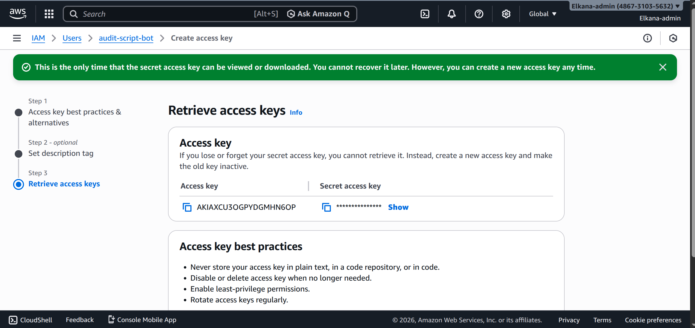
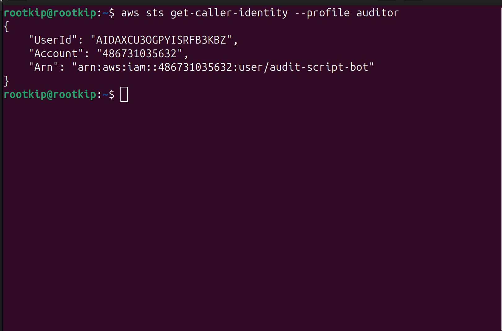
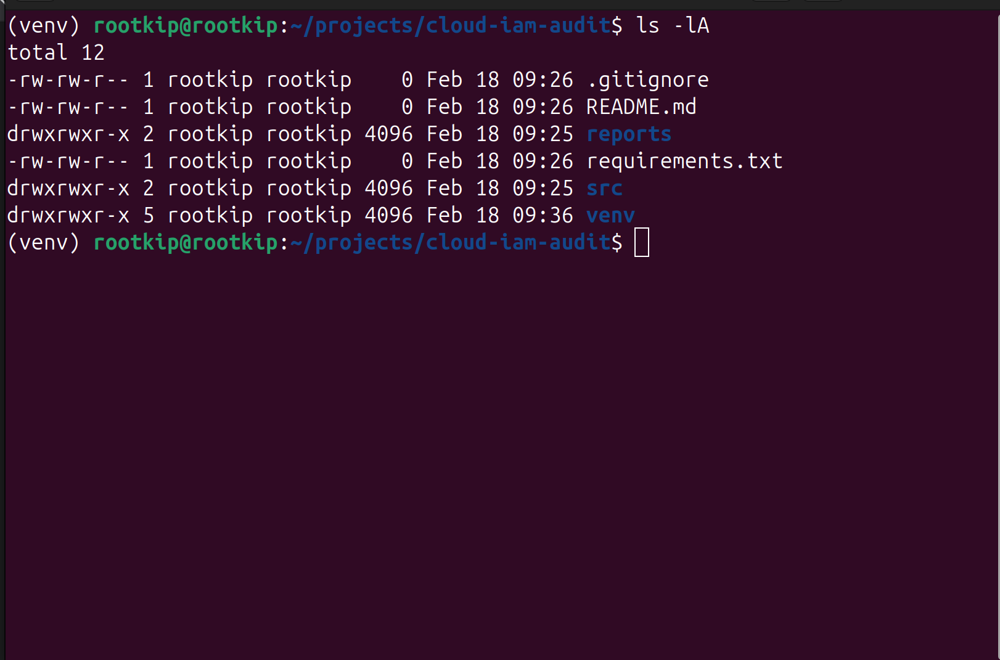
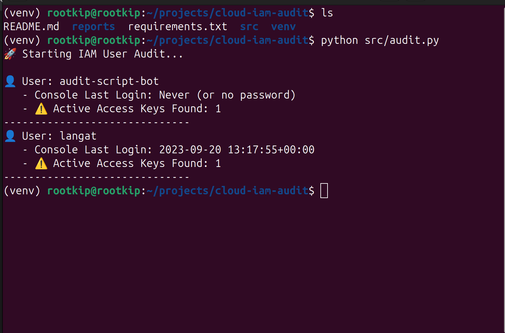

+++
title = "Automating AWS IAM Security Audits"
date = 2026-02-18
draft = false
summary = "An automated Python tool to audit AWS IAM users, identifying stale credentials and privilege risks without root access."
description = "Building a Python-based security auditor to detect stale accounts and enforce least privilege in AWS IAM."
tags = ["aws", "iam", "automation", "cloud-security", "least-privilege"]
categories = ["project"]

# Project metadata
github = "https://github.com/elkana-langat/cloud-iam-audit"
demo = ""
tech_stack = ["AWS IAM", "Python", "Boto3", "AWS CLI"]
role = "Cloud Security Engineer"
duration = "2 days"
featured = true

# Blowfish display settings
showHero = true
heroStyle = "background"
showDate = true
showReadingTime = false
showWordCount = false
showTableOfContents = true
+++

## Project Overview

In cloud environments, stale accounts and unused access keys are major attack vectors. Manual auditing is slow, unscalable, and prone to human error.

For this project, I engineered an automated Python tool to audit AWS Identity and Access Management (IAM) users. The objective was to programmatically identify security risks—specifically inactive users and exposed API keys—without requiring administrative access to the production environment.

---

## Architecture & Identity Setup

### 1. Least Privilege Design

**Objective:** Establish a secure, non-root identity to perform the audit.

Instead of using root credentials, I provisioned a dedicated IAM user (`audit-script-bot`) with strictly scoped permissions.

* **Policy Attached:** `ReadOnlyAccess` (AWS Managed Policy).
* **Security Rationale:** This enforces the **Principle of Least Privilege**. The auditor bot can *inspect* the configuration but cannot *mutate* it, eliminating the risk of accidental infrastructure damage or privilege escalation.

*Figure 1: Provisioning the least-privilege identity in the AWS Console.*

### 2. Secure Local Configuration

**Objective:** Prevent credential leakage and accidental cross-account actions.

I configured the AWS CLI using a **named profile** (`--profile auditor`). This segregates the project's credentials from personal or root credentials, preventing accidental execution against the wrong environment.

**Configuration Verification:**
I verified the identity using `sts get-caller-identity` to confirm the session was authenticated as the restricted `audit-script-bot`.

*Figure 2: Verifying the authenticated session via AWS STS.*

---

## Automation Logic (Python & Boto3)

**Objective:** Programmatically extract and analyze user data at scale.

I developed a Python script utilizing the **AWS SDK for Python (Boto3)**. To ensure the tool was production-ready, I implemented the following engineering patterns:

1. **Pagination Handling:** Utilized `iam.get_paginator` instead of standard list calls. This ensures the script scales to handle enterprise environments with thousands of users without truncating results.
2. **Error Handling:** Wrapped API calls in `ClientError` try/except blocks to gracefully handle permission denied errors or connection timeouts.
3. **Data Correlation:** The script correlates the `User` object (metadata) with a secondary API call to `list_access_keys` to provide a complete view of each user's risk profile.

### Dependency Isolation

To maintain a clean development environment, I utilized a Python **Virtual Environment** (`venv`), isolating project dependencies from the system-wide Python installation.

*Figure 3: Setting up the isolated Python environment and installing dependencies.*

---

## Outputs & Evidence

The tool successfully connected to AWS, iterated through the user base, and flagged accounts based on their console login activity and API key status.

**Key Findings Generated:**
* **Stale Console Access:** Users who have not logged in within the policy window.
* **Active Access Keys:** Users with active API keys that may require rotation.
* **MFA Status:** (Extended capability) Identification of users without Multi-Factor Authentication.

*Figure 4: The final audit report generated in the console.*

---

## Security Controls & Risk Mapping

This project directly addresses several critical security controls:

| Security Domain | Control Implemented | Risk Mitigated |
| :--- | :--- | :--- |
| **Identity Management** | Automated User Inventory | Shadow IT / Unmanaged Accounts |
| **Access Control** | Least Privilege (Auditor Role) | Excessive Permissions / Blast Radius |
| **Vulnerability Mgmt** | Stale Credential Detection | Account Takeover (ATO) via old keys |
| **DevSecOps** | Infrastructure as Code (Boto3) | Human Error in manual audits |

---

## Lessons Learned

* **Pagination is Non-Negotiable:** In initial tests with small datasets, standard API calls worked fine. However, designing for scale (using Paginators) is essential for any tool intended for enterprise use.
* **Profile Management:** Hardcoding credentials is a critical failure. Using AWS CLI profiles (`~/.aws/credentials`) is the only acceptable way to handle local secrets.
* **Read-Only Safety:** Separating "Audit" roles from "Remediation" roles prevents automated scripts from accidentally deleting resources during a bug.
